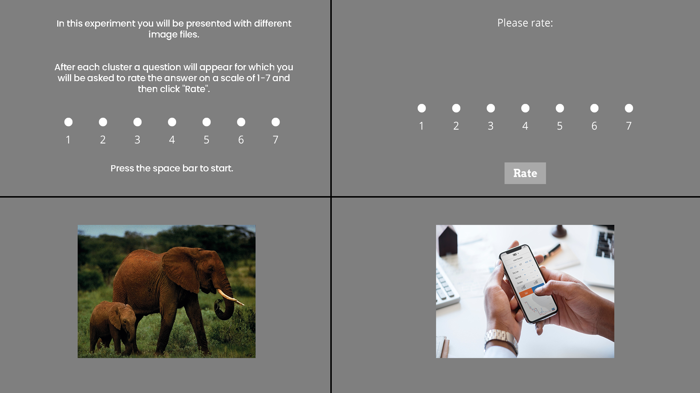
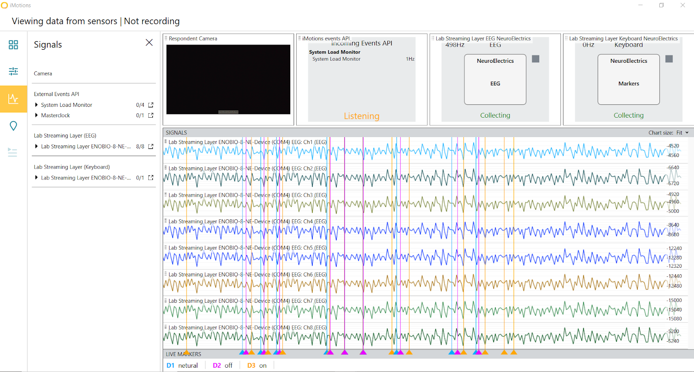

### Cue Reactivity
##### This experiment is a part of a wider EEG experiment. It is integrated with iMotions, Neuroelectrics, and JotForm.

-----

#### Description:
This experiment was created using [Psychopy](https://www.psychopy.org/), an open-source software package written in Python. Psychopy is a popular tool used in the fields of neuroscience and experimental psychology.

Description..

-----
#### Structure:
The experiment is divided into 5 main components:
1. Instructions.
2. Fixation.
3. Loop of 5 images (Netural/Phone_on/Phone_off)
4. Rating.
5. Repeat routines two-four (24 times).
5. Finish

-----
#### Flow:

-----
#### Examples:
Experiment Example:

iMotions Integration:

